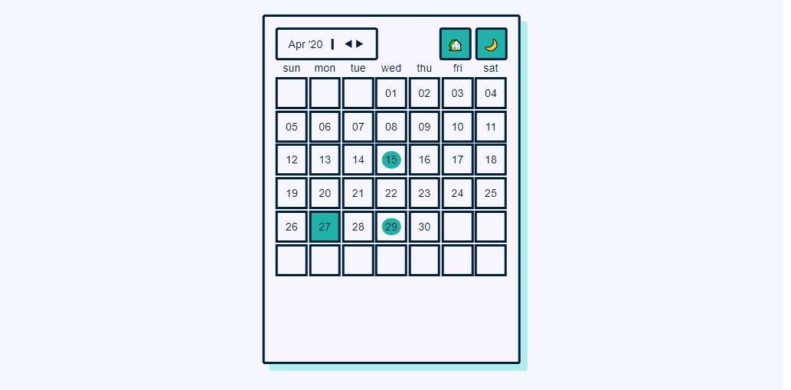

# React/Apollo Calendar

tldr: this is a to-do list attached to a calendar.

This is a functioning calendar into which users can add, update, read, and delete 
events relative to the month that is in view. This project was a big learning opportunity 
in terms of managing state at the application level via React's context API.  

## Getting Started

After cloning the repo, open the project and install dependencies in the root and client. Then:

in the project root:

```
npm run dev //build dist
```

on the server

```
npm run development 
//runs the mock database (3001), 
// apollo server (4000), and client (3000). 
// Allow some time for the project to open.
```

A live demo of the project will be available on Codesandbox [here](#). 
Until then the still below links to a short demo video! ⬇️

[](https://drive.google.com/file/d/1eiy_-kSahI7kw28D-icBHoDfMv2voY3T/preview)

## Todos

- Make the project more friendly to different screen sizes 
- update component composition to avoid prop drilling (The themeHook is particularly bad)
- Make interactions more interesting
- Tidy up typescript 
- Accessibility!
    - Most HTML elements are semantic but as the project has changed the flow is a little skewed.
    - Focus on event list when drawer opens 
        - and then on close, make sure focus returns to the Card that opened the drawer

## Built With

- [React](https://reactjs.org/) - The Js framework used
- [TypeScript](https://www.typescriptlang.org/docs/home.html) - Strong typing
- [Styled-Components](https://styled-components.com/) - CSS in Js
- [Apollo](https://www.apollographql.com/docs/) - GraphQL data layer
- [Json-Server](https://www.npmjs.com/package/json-server) - A library that
  mocks a simple database using a JSON file
- [Webpack](https://webpack.js.org/) - bundling the Apollo Server
- [Jest](https://jestjs.io/docs/en/getting-started) - Testing
- [Testing-Library](https://testing-library.com/docs/intro) - for testing React
  components in the DOM

## Acknowledgements

The listed articles/projects/tutorials have each helped me with this project one
way or another:

- [How to Use React Context Effectively](https://kentcdodds.com/blog/how-to-use-react-context-effectively) 
- [Setting up Webpack with Apollo-Server and Typescript](https://medium.com/free-code-camp/build-an-apollo-graphql-server-with-typescript-and-webpack-hot-module-replacement-hmr-3c339d05184f) -
  This tutorial was fairly comprehensive and helped clear up a whole bunch of questions.
