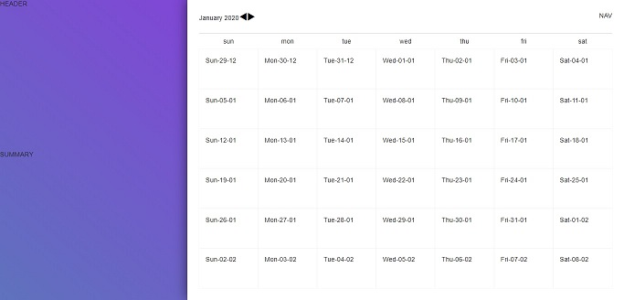

# React/Apollo Calendar

tldr: this is a to-do list attached to some form of calendar

## Getting Started

The setup is currently a little fiddly. After cloning the repo, open the project
and run 'npm i' in the root directory. Then cd into the client and run npm i
again. THEN:

First terminal:

```
cd .. //back into root
npm run dev //build dist
```

Second terminal:

```
npm run jsonserv //runs the mock database on 3001
```

Third terminal:

```
npm run start //runs the graphql endpoint on 4000
```

Fourth (final) terminal:

```
cd client
npm start //starts the client on 3000
```

A live demo of the project will be available on Codesanbox [here](#).



## Minimum requirements

- On loading the app renders a calendar displaying the present month with any
  events rendered on the appropriate date
- As a user I can navigate between months using the UI
- As a user I can Create, Read, Update, and Delete events via the the UI
- The date context should indicate to the calendar how many date cards should be
  returned
- Each individual date card should contain:
  - The date
  - Any events returned from the GQL endpoint

## At present

- Using the Apollo Playground I can create, read, update, and delete events
- Using GQL I can return an array of events on a given day or month
- On load, the client renders with the present date displayed
- I use the 'next' and 'back' buttons to change the month and year displayed on
  the simple date component
- The body of the calendar displays events

## Built With

- [React](https://reactjs.org/) - The Js framework used
- [TypeScript](https://www.typescriptlang.org/docs/home.html) - Strong typing
- [Styled-Components](https://styled-components.com/) - CSS in Js
- [Apollo](https://www.apollographql.com/docs/) - GraphQl data layer
- [Json-Server](https://www.npmjs.com/package/json-server) - A library that
  mocks a simple database using a JSON file
- [Webpack](https://webpack.js.org/) - bundling the Apollo Server
- [Jest](https://jestjs.io/docs/en/getting-started) - Testing
- [Testing-Library](https://testing-library.com/docs/intro) - for testing React
  components in the DOM

## Acknowledgements

The listed articles/projects/tutorials have each helped me with this project one
way or another:

- [How to Use React Context Effectively](https://kentcdodds.com/blog/how-to-use-react-context-effectively) -
  the date.context in my project is just an expanded version of Kent's
  overengineered counter context.
- [Setting up Webpack with Apollo-Server and Typescript](https://medium.com/free-code-camp/build-an-apollo-graphql-server-with-typescript-and-webpack-hot-module-replacement-hmr-3c339d05184f) -
  This tutorial was fairly comprehensive and helped clear up a whole bunch of
  questions.
